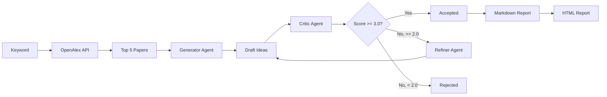

# Deep Research Agent 🔬

[](https://www.python.org/downloads/)
[](https://ollama.ai/)
[](https://opensource.org/licenses/MIT)

> **Multi-Agent Research Ideation System: Generator → Critic → Refiner Loop**

An automated system that searches for the latest papers via OpenAlex API and generates **top-tier journal-quality** research proposals through a multi-agent system.

## ✨ Key Features

- **📚 OpenAlex Integration**: Automatically fetches 100 latest papers based on keyword
- **🔄 Iterative Refinement Loop**: Generator → Critic → Refiner cyclic structure
- **🧠 Multi-Agent System**:
  - **Generator**: Paper-based idea generation (Chain of Thought + Critic-Solution Framework)
  - **Critic**: Evaluation on 4 criteria (Novelty, Feasibility, Specificity, Impact)
  - **Refiner**: Improves ideas based on critique feedback
- **💾 Ollama Local/Cloud**: Supports both local and cloud Ollama models
- **📊 Rich Reports**: Auto-generates detailed Markdown + HTML reports

## 🏗️ System Architecture



## 📁 Project Structure

```text
├── agents/                     # Agent Modules
│   ├── base_agent.py           # Base agent class
│   ├── generator.py            # OpenAlex + Idea generation
│   ├── critic.py               # Evaluation (4 criteria)
│   └── refiner.py              # Improvement based on feedback
├── core/                       # Core Infrastructure
│   ├── model_manager.py        # Ollama local/cloud management
│   ├── mcp_client.py           # MCP server client (mock)
│   └── types.py                # Data structures
├── prompts/                    # System Prompts
│   ├── generator_v2.txt
│   ├── critic_v2.txt
│   └── refiner_v2.txt
├── utils/                      # Utilities
│   ├── parser.py               # JSON parsing with fallback
│   ├── report_generator.py     # Markdown report
│   └── html_generator.py       # HTML conversion
├── results/                    # Generated Reports
├── config.yaml                 # Configuration
├── main.py                     # Entry Point
└── LICENSE                     # MIT License
```

## 🚀 Quick Start

### Prerequisites

- Python 3.12+
- [Ollama](https://ollama.ai/)

### Installation

```bash
git clone <repository-url>
cd 251212_Research_Ideation_Agent_with_MCP

pip install pyyaml requests
```

### Configuration

Edit `config.yaml`:

```yaml
ollama:
  base_url: "http://localhost:11434"    # Local Ollama
  cloud_url: "http://your-cloud:11434"  # Cloud Ollama (optional)

agent_models:
  generator:
    provider: "ollama"
    model: "gpt-oss:20b"
    temperature: 0.8

  critic:
    provider: "ollama-cloud"
    model: "deepseek-v3.1:671b-cloud"
    temperature: 0.1

  refiner:
    provider: "ollama-cloud"
    model: "gpt-oss:120b-cloud"
    temperature: 0.3

loop_settings:
  max_iterations: 2
  score_threshold: 3.0   # Minimum score to accept
  drop_threshold: 2.0    # Below this = rejected
```

### Run

```bash
python main.py --keyword "patents network analysis" --loops 3
```

### Output

- `results/research_results.json`: Full data in JSON format
- `results/research_report_YYYYMMDD_HHMMSS.md`: Markdown report
- `results/research_report_YYYYMMDD_HHMMSS.html`: Styled HTML report

## 📊 Output Example

### Generated Report Structure

```markdown
## Idea 1: Quantum-Enhanced Patent Citation Embedding

**Status:** `accepted`
**Total Iterations:** 2

### Evolution History

#### Iteration 0 - DRAFT
**Title:** Quantum-Enhanced Patent Citation Embedding
**Methodology:** Use quantum circuits for similarity computation...

##### 🧐 Critic Agent Evaluation
| Criterion | Score |
|---|---|
| Novelty | 3/5 |
| Feasibility | 3/5 |
| Specificity | 2/5 |
| Impact | 4/5 |
| **Average** | **3.00** |

#### Iteration 1 - REFINED
**Title:** Quantum-Inspired Contrastive Graph Kernels

##### 🔧 Refiner Agent Improvements
The critic noted vague methodology. Adding specific quantum kernel formulation...
```

## ⚙️ Scoring Rubric

| Score | Novelty | Feasibility | Specificity | Impact |
|---|---|---|---|---|
| **5** | Paradigm shift | Elegant implementation | Math formulas | Top-tier journal |
| **4** | Cross-domain fusion | Clear roadmap | Complete pipeline | Industry applicable |
| **3** | Domain adaptation | Theoretically possible | Standard algorithms | Field interest |
| **2** | Parameter tuning | Cost prohibitive | Missing causality | Niche improvement |
| **1** | Textbook knowledge | Impossible | Vague | Practice level |

### Thresholds

- **≥ 3.0**: Accepted
- **2.0 - 3.0**: Refinement needed
- **< 2.0**: Rejected

## 📜 License

This project is licensed under the MIT License - see the [LICENSE](LICENSE) file for details.

---

*Built with ❤️ for Research Innovation*
