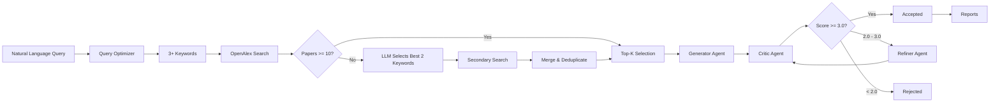

# Multi-agents based Research Topic Ideation System 🔬

[](https://www.python.org/downloads/)
[](https://ollama.ai/)
[](https://opensource.org/licenses/MIT)

> **Version 1.0**
>
> **Multi-Agent Research Ideation System: Generator → Critic → Refiner Loop**

An automated system that leverages **OpenAlex API** for real-time literature review and utilizes **Advanced LLMs (DeepSeek V3, GPT-OSS)** via Ollama Cloud to generate, critique, and refine **top-tier journal-quality** research proposals.

## ✨ Key Features

- **🔍 Smart Query Optimization**: Converts natural language intents into optimized search queries with exact phrase matching.
- **🔄 Keyword Combination Fallback**: When initial search returns <10 papers, automatically selects the best 2-keyword combination using LLM to expand the paper pool.
- **📚 Real-time Literature Review**: Fetches papers from **OpenAlex** (2020+) with deduplication.
- **🤖 Multi-Agent Pipeline**:
  - **Generator**: Uses **DeepSeek V3 (671B)** for idea generation with Chain of Thought.
  - **Critic**: Uses **GPT-OSS (120B)** to evaluate on Novelty, Feasibility, Specificity, and Impact.
  - **Refiner**: Uses **GPT-OSS (120B)** to improve ideas based on critique feedback.
- **☁️ Hybrid Operation**: Supports both **Local Ollama** and **Ollama Cloud**.
- **📊 Rich Reports**: Auto-generates **Markdown** and **HTML** reports.

## 🏗️ System Architecture



## 📁 Project Structure

```text
├── agents/                     # Agent Modules
│   ├── base_agent.py           # Base agent class
│   ├── generator.py            # Query optimization + Fallback + Idea generation
│   ├── critic.py               # Evaluation logic
│   └── refiner.py              # Refinement logic
├── core/                       # Core Infrastructure
│   ├── model_manager.py        # Model loading & Cloud/Local management
│   ├── mcp_client.py           # Context fetching
│   └── types.py                # Data types (IdeaObject, etc.)
├── prompts/                    # System Prompts
│   ├── generator.txt           # CoT + Critic-Solution Prompt
│   ├── critic.txt              # Evaluation Rubric
│   └── refiner.txt             # Improvement Instructions
├── utils/                      # Utilities
│   ├── parser.py               # Robust JSON parsing
│   ├── report_generator.py     # Markdown generation
│   └── html_generator.py       # HTML styling
├── results/                    # Output Directory
├── config.yaml                 # System Configuration
├── main.py                     # Entry Point
└── LICENSE                     # MIT License
```

## 🚀 Quick Start

### Prerequisites

- Python 3.12+
- [Ollama](https://ollama.ai/) (Local or Cloud endpoint)

### Installation

```bash
git clone <repository-url>
cd 251212_Research_Ideation_Agent_with_MCP

pip install pyyaml requests
```

### Configuration

```yaml
openalex:
  fetch_limit: 200        # Papers to fetch per query
  top_k_papers: 10        # Top papers for context

agent_models:
  generator:
    provider: "ollama-cloud"
    model: "deepseek-v3.1:671b-cloud"
    temperature: 0.5

  critic:
    provider: "ollama-cloud"
    model: "gpt-oss:120b-cloud"
    temperature: 0.5

  refiner:
    provider: "ollama-cloud"
    model: "gpt-oss:120b-cloud"
    temperature: 0.5

loop_settings:
  max_iterations: 1
  num_ideas: 3
  score_threshold: 3.0
  drop_threshold: 2.0
```

### Usage

Input **natural language research intents**:

```bash
python main.py --keyword "I would like to advance my research on preventing thermal runaway in LFP-based ESS systems."
```

**Example Output:**

```
[generator] Optimized Query: '"thermal runaway prevention" "lithium iron phosphate" "energy storage systems"'
[generator] Found 5 papers from OpenAlex.
[generator] Found only 5 papers. Attempting keyword combination fallback...
[generator] Fallback Query: '"thermal runaway prevention" "lithium iron phosphate"'
[generator] After fallback: 15 unique papers in pool.
```

## 📊 Output

Results are saved in the `results/` directory:

1. **`research_results.json`**: Complete structured data including evolution history.
2. **`research_report_DATE.md`**: Readable report with scores and feedback.
3. **`research_report_DATE.html`**: Professional HTML report for sharing.

## 📜 License

This project is licensed under the MIT License - see the [LICENSE](LICENSE) file for details.

---

*Powered by DeepSeek V3 & GPT-OSS*
