# Multi-agents based Research Topic Ideation System 🔬

[](https://www.python.org/downloads/)
[](https://ollama.ai/)
[](https://opensource.org/licenses/MIT)

> **Version 1.0**
>
> **Multi-Agent Research Ideation System: Generator → Critic → Refiner Loop**

An automated system that leverages **OpenAlex API** for real-time literature review and utilizes **Advanced LLMs (DeepSeek V3, GPT-OSS)** via Ollama Cloud to generate, critique, and refine **top-tier journal-quality** research proposals.

## ✨ Key Features

- **🔍 Smart Query Optimization**: Converts natural language intents into optimized search queries with exact phrase matching.
- **🔄 Keyword Combination Fallback**: When initial search returns <10 papers, automatically selects the best 2-keyword combination using LLM to expand the paper pool.
- **📚 Real-time Literature Review**: Fetches papers from **OpenAlex** (2020+) with deduplication.
- **🤖 Multi-Agent Pipeline**:
  - **Generator**: Uses **DeepSeek V3 (671B)** for idea generation with Chain of Thought.
  - **Critic**: Uses **GPT-OSS (120B)** to evaluate on Novelty, Feasibility, Specificity, and Impact.
  - **Refiner**: Uses **GPT-OSS (120B)** to improve ideas based on critique feedback.
- **☁️ Hybrid Operation**: Supports both **Local Ollama** and **Ollama Cloud**.
- **📊 Rich Reports**: Auto-generates **Markdown** and **HTML** reports.

## 🏗️ System Architecture

## System Architecture

```mermaid
graph TD
    %% Style Definitions (Aligned with Reference)
    classDef user fill:#f9f9f9,stroke:#333,stroke-width:2px,color:#000
    classDef agent fill:#e1f5fe,stroke:#01579b,stroke-width:2px,color:#01579b,rx:10,ry:10
    classDef tool fill:#fff3e0,stroke:#e65100,stroke-width:2px,color:#e65100,stroke-dasharray: 5 5
    classDef ai fill:#e8f5e9,stroke:#1b5e20,stroke-width:2px,color:#1b5e20
    classDef file fill:#fff,stroke:#333,stroke-width:1px,color:#333,shape:document

    %% 1. User Interaction Layer
    subgraph UI_Layer [💻 User Interface]
        User([User]):::user
        Input{Research Topic}:::user
    end

    %% 2. Agent Orchestration Layer
    subgraph Agent_Orchestration [🤖 Agent Workflow Pipeline]
        direction TB
        Generator(<b>Generator Agent</b><br/>Plan, Search & Draft):::agent
        Critic(<b>Critic Agent</b><br/>Review & Feedback):::agent
        Refiner(<b>Refiner Agent</b><br/>Rewrite & Polish):::agent
    end

    %% 3. Tools & Infrastructure Layer
    subgraph Tools_Infra [🛠️ Tools & Output]
        Tavily[🔍 Search Tool<br/>Tavily / MCP]:::tool
        Report[📄 Final Report<br/>HTML/Markdown]:::file
    end

    %% 4. AI Model Layer (Ollama)
    subgraph Ollama_Service [🦙 Ollama Local Infra]
        LLM[[Local LLM]]:::ai
    end

    %% Flow Definitions
    
    %% User Input Flow
    User --> Input
    Input -- "Initiate Task" --> Generator

    %% Phase 1: Generation
    Generator -- "1. Search Query" --> Tavily
    Tavily -- "Search Results" --> Generator
    Generator -- "Draft Content" --> LLM
    LLM -.-> Generator
    Generator -- "Initial Draft" --> Critic

    %% Phase 2: Critique
    Critic -- "Review Draft" --> LLM
    LLM -.-> Critic
    Critic -- "Critique & Feedback" --> Refiner

    %% Phase 3: Refinement
    Refiner -- "Refine Content" --> LLM
    LLM -.-> Refiner
    Refiner -- "Finalized Content" --> Report

    %% Optional Memory Optimization Note
    note_opt[⚡ Automatic Memory Management]
    Ollama_Service -.- note_opt
```



## 📁 Project Structure

```text
├── agents/                     # Agent Modules
│   ├── base_agent.py           # Base agent class
│   ├── generator.py            # Query optimization + Fallback + Idea generation
│   ├── critic.py               # Evaluation logic
│   └── refiner.py              # Refinement logic
├── core/                       # Core Infrastructure
│   ├── model_manager.py        # Model loading & Cloud/Local management
│   ├── mcp_client.py           # Context fetching
│   └── types.py                # Data types (IdeaObject, etc.)
├── prompts/                    # System Prompts
│   ├── generator.txt           # CoT + Critic-Solution Prompt
│   ├── critic.txt              # Evaluation Rubric
│   └── refiner.txt             # Improvement Instructions
├── utils/                      # Utilities
│   ├── parser.py               # Robust JSON parsing
│   ├── report_generator.py     # Markdown generation
│   └── html_generator.py       # HTML styling
├── results/                    # Output Directory
├── config.yaml                 # System Configuration
├── main.py                     # Entry Point
└── LICENSE                     # MIT License
```

## 🚀 Quick Start

### Prerequisites

- Python 3.12+
- [Ollama](https://ollama.ai/) (Local or Cloud endpoint)

### Installation

```bash
git clone <repository-url>
cd 251212_Research_Ideation_Agent_with_MCP

pip install pyyaml requests
```

### Configuration

```yaml
openalex:
  fetch_limit: 200        # Papers to fetch per query
  top_k_papers: 10        # Top papers for context

agent_models:
  generator:
    provider: "ollama-cloud"
    model: "deepseek-v3.1:671b-cloud"
    temperature: 0.5

  critic:
    provider: "ollama-cloud"
    model: "gpt-oss:120b-cloud"
    temperature: 0.5

  refiner:
    provider: "ollama-cloud"
    model: "gpt-oss:120b-cloud"
    temperature: 0.5

loop_settings:
  max_iterations: 1
  num_ideas: 3
  score_threshold: 3.0
  drop_threshold: 2.0
```

### Usage

Input **natural language research intents**:

```bash
python main.py --keyword "I would like to advance my research on preventing thermal runaway in LFP-based ESS systems."
```

**Example Output:**

```
[generator] Optimized Query: '"thermal runaway prevention" "lithium iron phosphate" "energy storage systems"'
[generator] Found 5 papers from OpenAlex.
[generator] Found only 5 papers. Attempting keyword combination fallback...
[generator] Fallback Query: '"thermal runaway prevention" "lithium iron phosphate"'
[generator] After fallback: 15 unique papers in pool.
```

## 📊 Output

Results are saved in the `results/` directory:

1. **`research_results.json`**: Complete structured data including evolution history.
2. **`research_report_DATE.md`**: Readable report with scores and feedback.
3. **`research_report_DATE.html`**: Professional HTML report for sharing.

## 📜 License

This project is licensed under the MIT License - see the [LICENSE](LICENSE) file for details.

---

*Powered by DeepSeek V3 & GPT-OSS*
