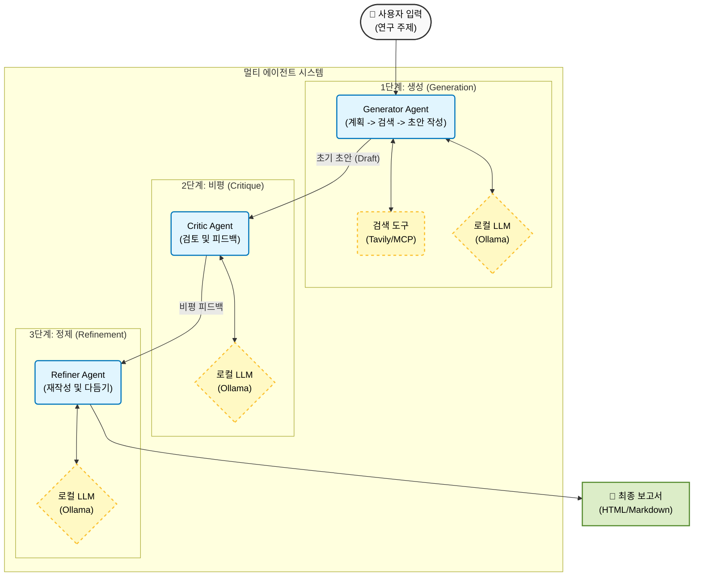

# 멀티 에이전트 기반 연구 주제 아이디어 생성 시스템 🔬

[](https://www.python.org/downloads/)
[](https://ollama.ai/)
[](https://opensource.org/licenses/MIT)

> **버전 1.0**
>
> **멀티 에이전트 연구 아이디어 시스템: 생성(Generator) → 비평(Critic) → 개선(Refiner) 루프**

**OpenAlex API**를 활용한 실시간 문헌 검토와 Ollama Cloud를 통한 **고급 LLM (DeepSeek V3, GPT-OSS)** 을 이용하여 **최상위 저널 수준**의 연구 제안서를 생성, 비평 및 개선하는 자동화 시스템입니다.

## ✨ 주요 기능

- **🔍 스마트 검색 최적화**: 사용자의 자연어 의도를 정확한 구문 매칭을 위한 최적화된 검색어로 변환합니다.
- **🔄 키워드 조합 대체 (Fallback)**: 초기 검색 결과가 10건 미만일 경우, LLM이 자동으로 최적의 2개 키워드 조합을 선택하여 논문 풀을 확장합니다.
- **📚 실시간 문헌 검토**: **OpenAlex** (2020년 이후)에서 논문을 가져오고 중복을 제거합니다.
- **🤖 멀티 에이전트 파이프라인**:
  - **생성자 (Generator)**: **DeepSeek V3 (671B)** 를 사용하여 생각의 사슬(Chain of Thought) 방식으로 아이디어를 생성합니다.
  - **비평가 (Critic)**: **GPT-OSS (120B)** 를 사용하여 참신성, 실현 가능성, 구체성, 파급 효과를 평가합니다.
  - **개선자 (Refiner)**: **GPT-OSS (120B)** 를 사용하여 비평 피드백을 바탕으로 아이디어를 개선합니다.
- **☁️ 하이브리드 운영**: **로컬 Ollama**와 **Ollama Cloud**를 모두 지원합니다.
- **📊 풍부한 보고서**: **Markdown** 및 **HTML** 보고서를 자동 생성합니다.

## 🏗️ 시스템 아키텍처

## System Architecture



## 📁 프로젝트 구조

```text
├── agents/                     # 에이전트 모듈
│   ├── base_agent.py           # 기본 에이전트 클래스
│   ├── generator.py            # 검색 최적화 + 폴백 + 아이디어 생성
│   ├── critic.py               # 평가 로직
│   └── refiner.py              # 개선 로직
├── core/                       # 핵심 인프라
│   ├── model_manager.py        # 모델 로딩 및 클라우드/로컬 관리
│   ├── mcp_client.py           # 컨텍스트 가져오기
│   └── types.py                # 데이터 타입 (IdeaObject 등)
├── prompts/                    # 시스템 프롬프트
│   ├── generator.txt           # CoT + 비평-솔루션 프롬프트
│   ├── critic.txt              # 평가 기준
│   └── refiner.txt             # 개선 지침
├── utils/                      # 유틸리티
│   ├── parser.py               # 견고한 JSON 파싱
│   ├── report_generator.py     # Markdown 생성
│   └── html_generator.py       # HTML 스타일링
├── results/                    # 출력 디렉토리
├── config.yaml                 # 시스템 설정
├── main.py                     # 진입점 (Entry Point)
└── LICENSE                     # MIT 라이선스
```

## 🚀 빠른 시작

### 사전 요구 사항

- Python 3.12+
- [Ollama](https://ollama.ai/) (로컬 또는 클라우드 엔드포인트)

### 설치

```bash
git clone <repository-url>
cd 251212_Research_Ideation_Agent_with_MCP

pip install pyyaml requests
```

### 설정

```yaml
openalex:
  fetch_limit: 200        # 검색당 가져올 논문 수
  top_k_papers: 10        # 컨텍스트로 사용할 상위 논문 수

agent_models:
  generator:
    provider: "ollama-cloud"
    model: "deepseek-v3.1:671b-cloud"
    temperature: 0.5

  critic:
    provider: "ollama-cloud"
    model: "gpt-oss:120b-cloud"
    temperature: 0.5

  refiner:
    provider: "ollama-cloud"
    model: "gpt-oss:120b-cloud"
    temperature: 0.5

loop_settings:
  max_iterations: 1       # 최대 개선 반복 횟수
  num_ideas: 3            # 생성할 아이디어 수
  score_threshold: 3.0    # 채택 기준 점수
  drop_threshold: 2.0     # 기각 기준 점수
```

### 사용법

**자연어로 된 연구 의도**를 입력하세요:

```bash
python main.py --keyword "I would like to advance my research on preventing thermal runaway in LFP-based ESS systems."
```

**출력 예시:**

```
[generator] Optimized Query: '"thermal runaway prevention" "lithium iron phosphate" "energy storage systems"'
[generator] Found 5 papers from OpenAlex.
[generator] Found only 5 papers. Attempting keyword combination fallback...
[generator] Fallback Query: '"thermal runaway prevention" "lithium iron phosphate"'
[generator] After fallback: 15 unique papers in pool.
```

## 📊 결과물

결과는 `results/` 디렉토리에 저장됩니다:

1. **`research_results.json`**: 발전 기록을 포함한 전체 구조화된 데이터
2. **`research_report_DATE.md`**: 점수와 피드백이 포함된 읽기 쉬운 보고서
3. **`research_report_DATE.html`**: 공유용 전문 HTML 보고서

## 📜 라이선스

이 프로젝트는 MIT 라이선스 하에 배포됩니다. 자세한 내용은 [LICENSE](LICENSE) 파일을 참조하세요.

---

*Powered by DeepSeek V3 & GPT-OSS*
